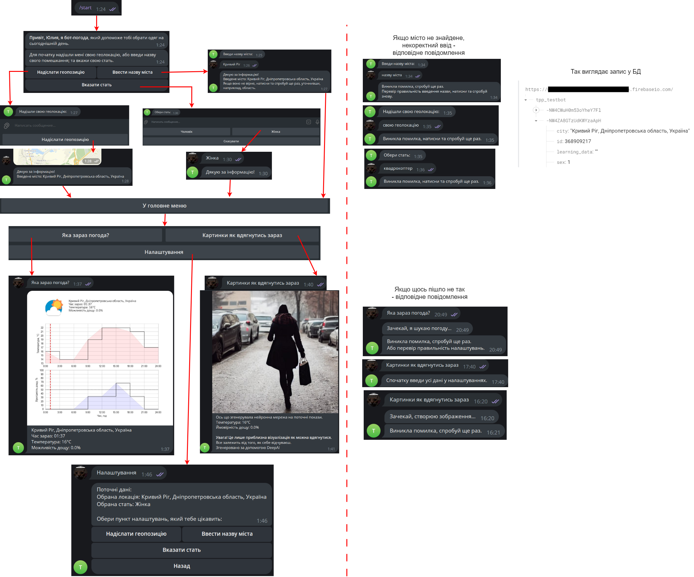

### Weather AI Bot
*(In the repository, the code is provided without the private folder containing private tokens)*

User functionality:
+ Request to display the weather for the selected city/other accommodation
+ Request to show an example image of how to dress for the weather now (generated by a neural network)
+ Changing user settings

Technologies used, as applied:
+ Selenium (parsing pages with actions)
+ Matplotlib, Seaborn (formation of weather graphics)
+ NumPy (data organization for graphics)
+ SQLite (access to the database if it is located locally)

Most used libraries (and how):
+ requests (parsing pages that do not require actions)
+ telebot (telegram bot programming)
+ PIL (work with graphics)
+ firebase_admin (interaction with realtime database)

Applied APIs:
+ Firebase (Realtime Database)
+ Lambdatest (cloud platform for execution of selenium actions)
+ Saucelabs (cloud platform for execution of selenium actions)

Work diagram:

One of the interaction scenarios (if the user is new):

